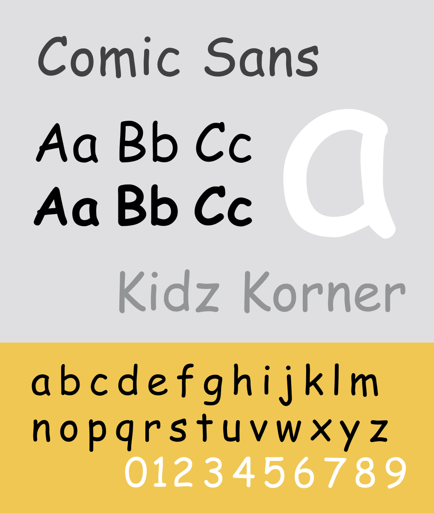
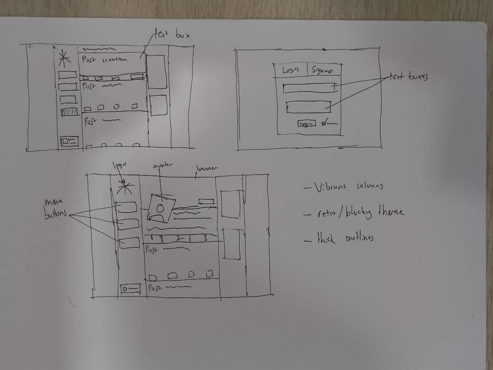

#edmondclient

# **29/07/25 - project brief**

**OVERVIEW**

The task is to produce a social network aimed at creating a global community where people can discuss, review, and give recommendations on movies and tv shows.

**FUNCTIONAL REQUIREMENTS**

- reliable
- reusable
- access multiple reviews
- portability
- curatability of reviews

**NON-FUNCTIONAL REQUIREMENTS**

- interesting, aesthetically pleasing
- show images, videos, text without lag
- strictly free platform

# **30/07/25 - Project Design**

**OVERVIEW**

Went over website design. E.g colour scheme, typography, icon styles/set, layout/wireframe

**Colour scheme**

**Typography/Font**

mix between


**Icon style/set**


**Website Wireframe**



# **07/09/2025 - Alternate design**

**OVERVIEW**

Went over an alternate design with changes to usage of colour scheme and post design.

**Main/Home page**


**Profile page**


**Movie Review Page**


# **12/08/2025 - test cases and algorithim design**

**algorithim**


**test cases**

test case id - 1

Test case name - Testing main functionality of login page.

Preconditions - user has registered account, already in login page

Test Steps

1. enter correct email into the email text box
2. enter correct password into the password text box
3. press the sign in button

Expected result - user successfully logs in, given they entered correct details

Actual result - user successfully logged in

Pass/Fail - pass

priority - high

#

Test case id - 2

Test case name - testing forgot password functionality

Preconditions - user has registered account, already in login page

Test steps

1. enter correct email into the email text box
2. enter an incorrect password into the password text box
3. press sign in button
4. press the expected "forgot password" button

Expected result - user is directed to the forgot password page

Actual result - user is directed to the forgot password page

Pass/Fail - pass

Priorirty - medium

# **21/08/25 - database setup and query testing**

**OVERVIEW**

Created sqlite3 database, filled it with mock data, and created + tested query's to test database.

**Queries**

1. List all users and the amount of posts they have

```sql
SELECT u.userID, u.name, u.email, COUNT(p.postID) AS total_posts
FROM USER u
LEFT JOIN post p ON u.userID = p.userID
GROUP BY u.userID, u.name, u.email
ORDER BY total_posts DESC;
```

2. Find the 10 most recent posts with user names

```sql
SELECT p.postID, u.name, p.title, p.content, p.postdate
FROM post p
JOIN USER u ON p.userID = u.userID
ORDER BY p.postdate DESC
LIMIT 10;
```

3. average rating per user

```sql
SELECT u.userID, u.name, AVG(p.rating) AS avg_rating
FROM USER u
JOIN post p ON u.userID = p.userID
GROUP BY u.userID, u.name
ORDER BY avg_rating DESC;
```

4. Posts containing a specific keyword (e.g., "Hello")

```sql
SELECT p.postID, u.name, p.title, p.content, p.postdate
FROM post p
JOIN USER u ON p.userID = u.userID
WHERE p.content LIKE '%Loved this!%'
ORDER BY p.postdate DESC
```

5. Users who never posted anything

```sql
SELECT u.userID, u.name, u.email
FROM USER u
LEFT JOIN post p ON u.userID = p.userID
WHERE p.postID IS NULL;`
```

# **01/09/25 - Setting up webapp**

**OVERVIEW**

Working through webapp template document. However, i was encountering errors which i tried to solve my reviewing code and seeing if I wrote the right code. After failing to fix the errors, I started looking into the error messages themselves and console logs. Shortly after this I got the website to show. At first, data was not showing but I got it to work after reviewing my code further.

# **08/09/25 - Styling/Functionality**

Implement 2 sidebars, one for the menu and one for a later "news" section. The menubar has the most basic functionality.

# **23/09/25 - Login page creation + lighthouse reports + serviceworker**

Created and styled a login page. Does not have any functionality yet. Also redid database to later cater for users logging in and signing up. Got serviceworker running.

**Lighthouse report**

performance: 97

Accecibility:92

SEO: 89

Best practice: 98

# **30/09/25 - profile page and full rework**

Created a profile page and attempted to add functionality to login and profile page. Still errors with logging in and displaying user data. Started on a full rework including restyling everything to original vision.

# **07/10/25 - reworked everything + login working**

Restyled everything to use fit original vision including baisic layout changes, colour changes, typography and other styling changes.

# **09/10/25 - styling issues again**

Fixed new styling issues that appeared after modifying login again.

# **14/10/25 - post creation + edit profile**

Finally implemented post creation system and got everything to display. Also created a edit profile page that allows for uploading of profile pictures, bio changes, name changes, and banner uploads.

# **15/10/25 - fixed all styling and display issues + progress on documentation**

Fixed issues with items not displaying and styling bugs/errors.

# **Final Lighthouse report**

Performance: 63

Accessibility: 100

SEO: 100

Best practices: 89

# **USER NOTES**

- download the zip file
- extract the zip file
- right click the "edmondclient" folder and press open in terminal.
- In the terminal, run `python main.py`
- go to http://127.0.0.1:500
- create an account or use premade test account
  > email: test@example.com
  >
  > password: test123
- If not working, make sure flask and dependecies are installed.

# **acknowledgements**

- oepn ai chatgpt
- claude ai
- icons8 forma-regular icons
