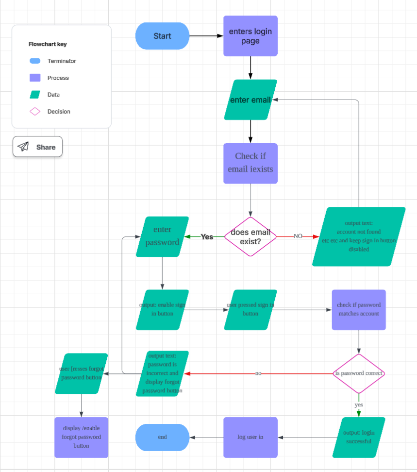

#edmondclient

# **29/07/25 - project brief**

**OVERVIEW**

The task is to produce a social network aimed at creating a global community where people can discuss, review, and give recommendations on movies and tv shows.

**FUNCTIONAL REQUIREMENTS**

- reliable
- reusable
- access multiple reviews
- portability
- curatability of reviews

**NON-FUNCTIONAL REQUIREMENTS**

- interesting, aesthetically pleasing
- show images, videos, text without lag
- strictly free platform

# **30/07/25 - Project Design**

(H2)**OVERVIEW**(H2)

Went over website design. E.g colour scheme, typography, icon styles/set, layout/wireframe

**Colour scheme**

**Typography/Font**

**Icon style/set**

**Website Wireframe**

[insert image in a bit]

# **07/09/2025 - Alternate design**

**OVERVIEW**

Went over an alternate design with changes to usage of colour scheme and post design.

**Main/Home page**

**Profile page**

**Movie Review Page**

# **12/08/2025 - test cases and algorithim design**

**algorithim**

**test cases**

test case id - 1

Test case name - Testing main functionality of login page.

Preconditions - user has registered account, already in login page

Test Steps

1. enter correct email into the email text box
2. enter correct password into the password text box
3. press the sign in button

Expected result - user successfully logs in, given they entered correct details

Actual result - user successfully logged in

Pass/Fail - pass

priority - high

#

Test case id - 2

Test case name - testing forgot password functionality

Preconditions - user has registered account, already in login page

Test steps

1. enter correct email into the email text box
2. enter an incorrect password into the password text box
3. press sign in button
4. press the expected "forgot password" button

Expected result - user is directed to the forgot password page

Actual result - user is directed to the forgot password page

Pass/Fail - pass

Priorirty - medium

# **21/08/25 - database setup and query testing**

**OVERVIEW**
